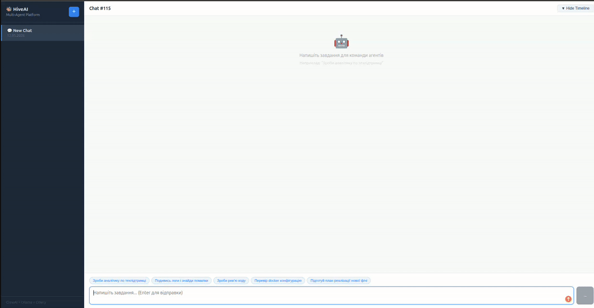

# HiveAI

> **The nervous system of your IT company.** One chat — a team of AI specialists executes across every internal system.

[](LICENSE)
[](https://python.org)
[](docker-compose.yml)
[](#switching-llm)



**Integrations:** Confluence · Jira · GitHub · Support DB (MySQL) &nbsp;·&nbsp; **100% self-hosted** · any OpenAI-compatible LLM

---

## Why HiveAI?

| Without HiveAI | With HiveAI |
|----------------|-------------|
| Switching between Jira, Confluence, GitHub manually | One chat — orchestrator decides what to do and where |
| SLA reports take hours to compile, or never get written | Analytics on demand — agent connects to every data source and returns a ready report |
| Documentation written manually, goes stale immediately | Documentation generated and published automatically |
| New hire spends weeks learning the infrastructure | Company knowledge base instantly available to every agent |
| Routine work consumes specialists' time | Routine → agents. People → creative and complex work |

---

## Key capabilities

**Speed** — 30–60 minutes of routine becomes 2–3 minutes, every day for every team member.

**Extensibility** — New agents, integrations, and workflows connect without stopping the platform. Add a new agent in ~10 lines of Python.

**Control** — Enable or disable any agent or individual tool at runtime, no restart needed. Complete log of every action.

**Privacy** — Runs entirely on your servers with a local LLM (Ollama). Or swap in any OpenAI-compatible API — your choice.

---

## Quick Start

### 1. Install Ollama

**macOS / Linux:**
```bash
curl -fsSL https://ollama.com/install.sh | sh
ollama serve
ollama pull qwen2.5:14b
```

**Windows:** download from [ollama.com](https://ollama.com)

### 2. Configure environment

```bash
cp .env.example .env
```

Defaults work for local Ollama out of the box:
```env
LLM_PROVIDER=ollama
LLM_MODEL=qwen3:14b
LLM_BASE_URL=http://host.docker.internal:11434
LLM_SUPPORTS_TOOLS=true
```

### 3. Start

```bash
docker compose up --build
```

First run takes 5–10 minutes (image downloads + frontend build).

### 4. Open

| URL | Description |
|-----|-------------|
| http://localhost:3000 | Chat UI |
| http://localhost:8000/docs | API docs (Swagger) |
| http://localhost:5555 | Celery Flower monitor |

---

## How it works

```
User writes a task in natural language
        ↓
ChiefOrchestrator — builds a plan, delegates, evaluates, synthesizes
        ↓
Specialized agents execute via Celery workers
        ↓
Each agent uses tools to interact with real systems
        ↓
Result returned to the user
```

**Example:**
> *"Analyze why support tickets about access issues tripled this month, and post a summary to Confluence"*

1. `DataAnalystAgent` → queries ticket database, identifies the spike pattern
2. `DevOpsAgent` → checks server logs for related errors in the same period
3. `BackendDeveloperAgent` → reviews recent GitHub changes in the auth module
4. `ProjectManagerAgent` → creates a Confluence page with consolidated findings
5. Final answer includes the page link

---

## Agents

| Agent | Role | Integrations |
|-------|------|--------------|
| ChiefOrchestrator | Plans, delegates, evaluates, synthesizes | — |
| ProjectManager | Tasks, sprints, documentation | Confluence · Jira |
| BackendDeveloper | Code, reviews, docs | GitHub · Confluence · Jira |
| QAEngineer | Tests, bug reports, quality checks | Jira · GitHub |
| BusinessAnalyst | Process analysis, requirements | Confluence · Jira · Fleio |
| SupportEngineer | Client support tickets | Jira · Fleio |
| DataAnalyst | SLA metrics, trends, statistics | Fleio · MySQL |
| DevOps | Logs, infrastructure | GitHub · Logs |

New agents plug in without touching the orchestrator. See [Adding a new agent](#adding-a-new-agent).

---

## Knowledge base

Agents share a persistent knowledge base. Each agent has **private entries** (visible only to itself) and access to **global entries** (shared across the team).

The orchestrator reads a summary of available knowledge topics when planning — so agents don't re-discover what's already known.

```bash
# Add company-wide knowledge
curl -X POST http://localhost:8000/api/knowledge \
  -H "Content-Type: application/json" \
  -d '{"title": "Infrastructure overview", "content": "...", "tags": "infra,servers"}'

# List all entries
curl http://localhost:8000/api/knowledge | jq .
```

Agents also write to the knowledge base themselves using `KnowledgeSave` and `KnowledgeAppend` tools — with a mandatory `reason` field to prevent noise.

---

## Usage examples

```
Write technical documentation for the auth module and publish it to Confluence

Create a Jira task for implementing dark mode with High priority

Analyze support ticket trends from last month and find the top recurring issues

Investigate the 503 errors in service logs and summarize the root cause

List all open In Progress tickets in the DEV project

Which clients submitted the most support tickets this week?

Show SLA performance for the last 30 days

What changed in the codebase since last Friday?
```

---

## Vision

HiveAI is built to become the **nervous system of an IT company** — not a single tool, but a living platform embedded in every process.

### Where the platform is heading

| Scenario | Description |
|----------|-------------|
| Support on autopilot | New client request → agent analyzes similar cases, proposes a response. Staff reviews and approves. |
| Self-writing documentation | After every code change an agent automatically updates internal documentation. |
| Always-fresh analytics | Weekly automated SLA and ticket reports — zero manual steps. |
| Rapid incident diagnosis | Failure signal → agent analyzes logs, tasks, and recent changes, produces a root cause report in minutes. |
| Standup in seconds | Agent collects progress from all systems and summarizes it before the meeting. |
| Your scenario | New agents, integrations, and workflows connect without stopping the platform. |

### Next integrations

| Integration | Status |
|------------|--------|
| OpenStack (VM, projects, networks) | Planned |
| Slack / Telegram notifications | Planned |
| Grafana metrics & alerts | Planned |
| PagerDuty / Zabbix incidents | Planned |
| CRM | Future |

---

## Developer docs

### Agent & tool management

Enable or disable individual agents and their tools via API — no restart needed.

```bash
# Disable an agent
curl -X PATCH http://localhost:8000/api/agents/BackendDeveloperAgent \
  -H "Content-Type: application/json" -d '{"is_enabled": false}'

# Disable a specific tool for an agent
curl -X PATCH http://localhost:8000/api/agents/ProjectManagerAgent/tools/JiraCreateIssueTool \
  -H "Content-Type: application/json" -d '{"is_enabled": false}'

# List all agents and their tools
curl http://localhost:8000/api/agents | jq .
```

### Switching LLM

Edit `.env` and restart `backend` + `worker`:

```env
# Ollama (local)
LLM_PROVIDER=ollama
LLM_MODEL=llama3.1:8b
LLM_BASE_URL=http://host.docker.internal:11434

# OpenAI
LLM_PROVIDER=openai
LLM_MODEL=gpt-4o
LLM_BASE_URL=https://api.openai.com/v1
LLM_API_KEY=sk-...

# Any OpenAI-compatible provider (LM Studio, LocalAI, etc.)
LLM_PROVIDER=openai
LLM_MODEL=local-model
LLM_BASE_URL=http://host.docker.internal:1234/v1
LLM_API_KEY=lm-studio
```

```bash
docker compose restart backend worker
```

### Adding a new agent

1. Create `backend/app/agents/my_agent.py`:

```python
from app.agents.base import BaseITAgent
from app.tools.knowledge import get_knowledge_tools

class MyAgent(BaseITAgent):
    name = "MyAgent"
    role = "Senior My Role"
    goal = "What this agent achieves"
    backstory = "Background that shapes how the LLM behaves"
    description = "One-line description for the orchestrator"
    capabilities = ["capability 1", "capability 2"]

    def get_tools(self):
        return [*get_knowledge_tools(agent_name=self.name)]
```

2. Register in `backend/app/agents/agent_registry.py`:

```python
from app.agents.my_agent import MyAgent

AGENT_REGISTRY = {
    ...
    "MyAgent": MyAgent(),
}
```

Restart `backend` + `worker` — the orchestrator discovers agents from the registry automatically.

### Adding a new tool

```python
from pydantic import BaseModel, Field
from app.tools.base import LoggedTool

class MyToolInput(BaseModel):
    query: str = Field(description="What to search for")

class MyTool(LoggedTool):
    name: str = "MyTool"
    description: str = "Clear description — the LLM reads this to decide when to use the tool"
    args_schema: type[BaseModel] = MyToolInput

    def _run(self, query: str) -> str:
        return f"result for: {query}"
```

Add it to the relevant agent's `get_tools()` method. See [backend/app/tools/TOOLS.md](backend/app/tools/TOOLS.md) for full tools reference.

### Architecture

```
Browser
  │
  ▼
FastAPI (backend :8000)
  │  REST API + polling
  ▼
Celery Task  ──────────────────────────────────────
  │                                               │
  ▼                                               ▼
ChiefOrchestrator                           PostgreSQL
  │  plan → run → evaluate → synthesize     (results, logs,
  │                                          agent runs, knowledge)
  ├── ProjectManagerAgent     ──► Confluence · Jira
  ├── BackendDeveloperAgent   ──► Confluence · Jira · GitHub
  ├── QAEngineerAgent         ──► Jira · GitHub
  ├── BusinessAnalystAgent    ──► Confluence · Jira · Fleio
  ├── SupportEngineerAgent    ──► Jira · Fleio
  ├── DataAnalystAgent        ──► Fleio
  └── DevOpsAgent             ──► GitHub · logs

All agents ──► Knowledge Base (private + global entries)

Redis ← Celery broker
```

| Service | Technology | Port |
|---------|-----------|------|
| frontend | React + Vite → nginx | 3000 |
| backend | FastAPI + Python | 8000 |
| worker | Celery (prefork) | — |
| redis | Redis 7 | 6379 |
| postgres | PostgreSQL 16 | 5432 |
| flower | Celery monitor | 5555 |

### Project structure

```
it-company/
├── docker-compose.yml
├── .env.example
├── backend/
│   ├── app/
│   │   ├── agents/
│   │   │   ├── agent_registry.py     # Register agents here
│   │   │   ├── base.py               # BaseITAgent + get_active_tools()
│   │   │   ├── backend_developer.py
│   │   │   ├── business_analyst.py
│   │   │   ├── data_analyst.py
│   │   │   ├── devops.py
│   │   │   ├── project_manager.py
│   │   │   ├── qa_engineer.py
│   │   │   ├── support_engineer.py
│   │   │   └── runners/
│   │   │       └── langgraph_runner.py  # ReAct agent loop
│   │   ├── orchestrator/
│   │   │   └── orchestrator.py       # Planning, evaluation, synthesis
│   │   ├── tools/
│   │   │   ├── base.py               # LoggedTool base class
│   │   │   ├── confluence.py         # Confluence read/write tools
│   │   │   ├── jira.py               # Jira read/write tools
│   │   │   ├── git_serch.py          # GitHub repository listing
│   │   │   ├── local_repo.py         # Clone, read, edit local repos
│   │   │   ├── fleio_support.py      # Fleio MySQL read-only tools
│   │   │   ├── knowledge.py          # Agent knowledge base tools
│   │   │   └── TOOLS.md              # Full tools reference
│   │   ├── models/                   # SQLAlchemy models
│   │   │   ├── agent.py
│   │   │   ├── agent_tool_config.py
│   │   │   ├── integration_config.py
│   │   │   └── knowledge_entry.py
│   │   ├── api/
│   │   │   ├── agent_config.py       # GET/PATCH /api/agents
│   │   │   ├── integrations.py       # GET/PATCH /api/integrations
│   │   │   └── knowledge.py          # CRUD /api/knowledge
│   │   ├── db/
│   │   │   ├── seed.py               # Upsert agents, tools, configs on startup
│   │   │   └── integration_config_helper.py
│   │   └── core/
│   │       ├── llm.py                # LLM factory (Ollama / OpenAI-compatible)
│   │       └── celery_app.py
│   └── alembic/                      # DB migrations
└── frontend/
    └── src/
        ├── App.jsx
        └── components/
            ├── ChatList.jsx
            ├── ChatWindow.jsx
            ├── MessageList.jsx
            ├── MessageInput.jsx
            ├── AgentRunTimeline.jsx
            ├── RunDetailPage.jsx
            └── StatusBadge.jsx
```

### Database schema

```
chats
  └── tasks (Celery task per message)
        └── agent_runs (one per agent invocation)
              ├── parent_run_id → orchestrator run
              ├── input_payload (full task + prior context)
              ├── output_payload
              └── worker_logs

agents
  └── agent_tool_configs (per-agent tool enable/disable)

integration_configs (Confluence, Jira, GitHub, Fleio credentials)

knowledge_entries
  ├── agent_name NULL  → global (visible to all agents)
  └── agent_name SET   → private (visible only to that agent)
```

### Useful commands

```bash
# View worker logs
docker compose logs -f worker

# Run migration manually
docker compose exec backend alembic upgrade head

# Check LLM health
curl http://localhost:8000/api/health/llm | jq .

# List all agents with their tools
curl http://localhost:8000/api/agents | jq .

# List all integration configs
curl http://localhost:8000/api/integrations | jq .

# View agent runs
curl http://localhost:8000/api/chats/1/agent-runs | jq .

# Rebuild a single service
docker compose up -d --build worker
```

---

## License

[AGPL-3.0](LICENSE) — Bohdan Chernii, 2026.
